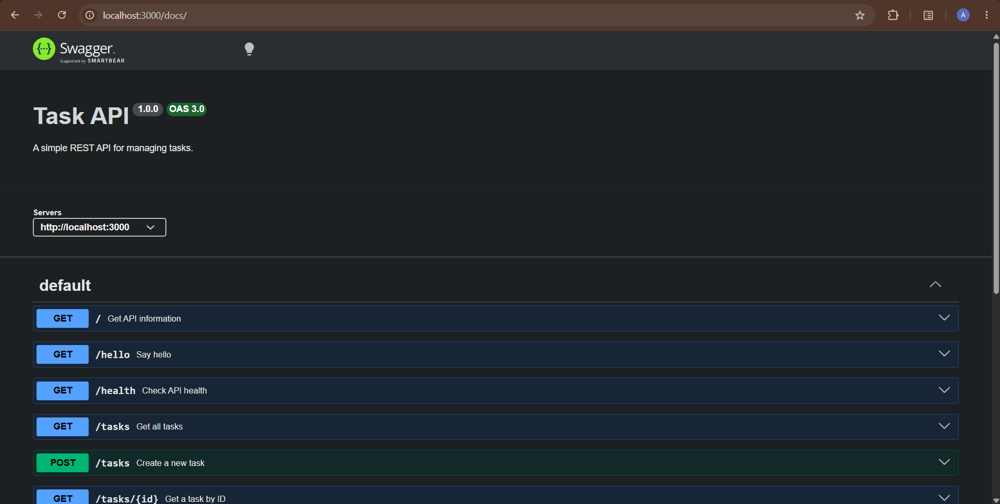

# Task API

A simple REST API built with **Node.js** and **Express** for managing tasks. The project also includes an **OpenAPI 3.0 specification** and an interactive **Swagger UI** for testing and documenting the API.

## Installation & Running

Install dependencies and start the API:

```bash
npm install && node app.js
```

The API runs at:

```text
http://localhost:3000
```

Swagger UI:

```text
http://localhost:3000/docs
```

## Endpoints

| Method   | Endpoint     | Description            | Success |
| -------- | ------------ | ---------------------- | ------- |
| `GET`    | `/`          | Get API information    | `200`   |
| `GET`    | `/hello`     | Return a hello message | `200`   |
| `GET`    | `/health`    | Check API health       | `200`   |
| `GET`    | `/tasks`     | Get all tasks          | `200`   |
| `GET`    | `/tasks/:id` | Get a task by ID       | `200`   |
| `POST`   | `/tasks`     | Create a new task      | `201`   |
| `PUT`    | `/tasks/:id` | Update a task          | `200`   |
| `DELETE` | `/tasks/:id` | Delete a task          | `204`   |

### Example: Create a Task

```bash
curl -i -X POST http://localhost:3000/tasks \
  -H "Content-Type: application/json" \
  -d "{\"title\":\"Learn OpenAPI\"}"
```

Example output:

```text
HTTP/1.1 201 Created
Content-Type: application/json; charset=utf-8
Content-Length: 47

{"id":3,"title":"Learn OpenAPI","done":false}
```

## Swagger Documentation

The API is documented using an OpenAPI specification stored in `openapi.json`.

Swagger UI provides an interactive interface for viewing and testing all documented endpoints.



## Project Structure

```text
be-01/
├── app.js
├── openapi.json
├── swagger.png
├── package.json
└── README.md
```

### The mortality experiment

After creating new tasks and restarting the server, the new tasks disappeared because the API stores tasks only in an in-memory JavaScript array. When the Node.js process restarts, the array is initialized again with the seed tasks, so changes made during the previous process are lost.
